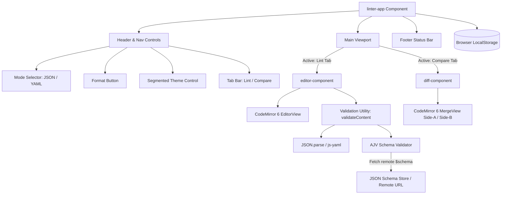
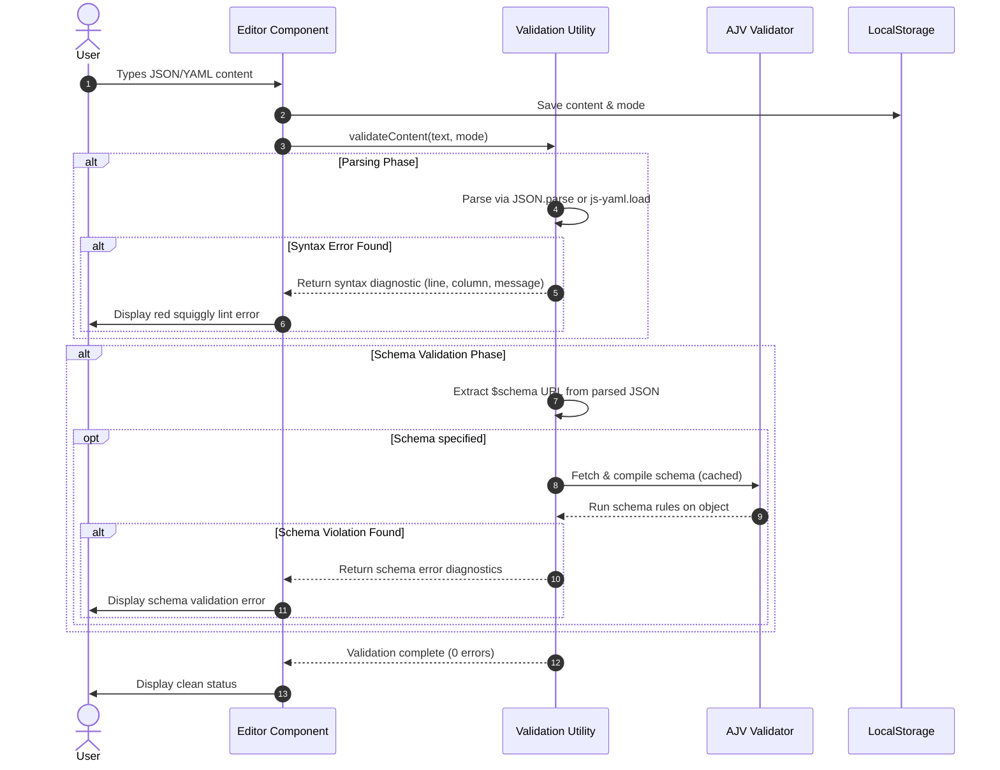

# Linter.ai - JSON/YAML Linter & Diff Tool

[](https://github.com/agent-oriented-testing/linter/actions/workflows/deploy.yml)
[](LICENSE)

> A modern, lightning-fast, and static Web-based JSON and YAML linter, formatter, schema validator, and side-by-side text comparison tool built with Lit, CodeMirror 6, and TypeScript.

---

## 📌 Repository Metadata (Source of Truth)

This section serves as the canonical source of truth for the GitHub Repository settings and metadata.

* **Repository Name**: `linter`
* **Short Description**: Fast, static client-side JSON/YAML linter, schema validator, auto-formatter, and side-by-side diff tool built with Lit and CodeMirror 6.
* **Website / Live Demo**: Hosted on GitHub Pages via automated workflow.
* **Repository Topics / Keywords**:
  `json-linter` • `yaml-linter` • `json-schema` • `diff-tool` • `codemirror-6` • `lit-element` • `web-components` • `typescript` • `vite` • `client-side` • `ajv` • `developer-tools`

---

## ✨ Features

- ⚡ **Real-Time Linting**: Instant syntax error detection and in-editor diagnostics for both JSON and YAML files.
- 📋 **JSON Schema Validation**: Automatic fetching and validation of remote schemas referenced via the `$schema` property using AJV.
- 🔄 **Side-by-Side Diff View**: Visual comparison of two document versions using CodeMirror 6's MergeView with inline insertion/deletion highlighting.
- 🧹 **Auto-Formatting**: One-click beautification and formatting for JSON and YAML content.
- 🎨 **Theme Customization**: Built-in 3-state theme selector (System Default 🖥️, Light ☀️, Dark 🌙) with seamless CodeMirror 6 theme synchronization.
- 💾 **Local Storage Persistence**: Automatic client-side persistence of editor content, active mode, and theme preferences.
- 🚀 **Zero Backend Required**: Fully client-side SPA with no server dependencies, ensuring privacy and fast performance.
- ♿ **Accessible UI**: Built with accessible ARIA tab lists, radio groups, keyboard navigation, and focus rings.

---

## 🏗️ System Architecture

`Linter.ai` is structured as a client-side Single Page Application (SPA) leveraging Lit Web Components and CodeMirror 6.



---

## 🔄 Client-Side Data Flow

The flow diagram below illustrates how user inputs trigger real-time syntax checking, schema validation, and persistence.



---

## 🛠️ Tech Stack

- **UI Framework**: [Lit](https://lit.dev/) (Lightweight Web Components)
- **Language**: [TypeScript 6](https://www.typescriptlang.org/) (Strictly typed)
- **Code Editor**: [CodeMirror 6](https://codemirror.net/) (`@codemirror/view`, `@codemirror/state`, `@codemirror/lint`, `@codemirror/merge`)
- **Parsers & Validators**:
  - [AJV](https://ajv.js.org/): JSON Schema validation
  - [js-yaml](https://github.com/nodeca/js-yaml): YAML parsing and stringification
- **Build Tool & Bundler**: [Vite 8](https://vitejs.dev/)
- **Testing Frameworks**:
  - [Vitest](https://vitest.dev/): Fast unit testing
  - [Playwright](https://playwright.dev/): End-to-end browser testing
- **Deployment**: [GitHub Actions](https://github.com/features/actions) & GitHub Pages

---

## 🚀 Getting Started

### Prerequisites

- **Node.js**: `v24` (LTS) or later
- **npm**: `v10` or later

### Installation

1. Clone the repository:
   ```bash
   git clone https://github.com/agent-oriented-testing/linter.git
   cd linter
   ```

2. Install dependencies:
   ```bash
   npm install
   ```

### Development Server

Start the local development server with hot module replacement (HMR):

```bash
npm run dev
```

Open your browser at `http://localhost:5173`.

### Production Build

Compile TypeScript and build the static bundle with Vite:

```bash
npm run build
```

Preview the production build locally:

```bash
npm run preview
```

---

## 🧪 Testing

The project includes unit tests for core utilities and end-to-end tests for UI interaction.

### Running Unit Tests

Run unit tests once using Vitest:

```bash
npm run test
```

Run unit tests in watch mode during development:

```bash
npm run test:watch
```

### Running End-to-End (E2E) Tests

E2E tests use Playwright to verify editor interactions, formatting, diffing, and theme toggling across real browser engines.

First, ensure Playwright browsers are installed:

```bash
npx playwright install chromium
```

Execute E2E test suite:

```bash
npm run test:e2e
```

---

## 📜 JSON Schema Validation

When editing JSON documents, `Linter.ai` automatically detects the `$schema` root property.

### Example:
```json
{
  "$schema": "https://json.schemastore.org/package.json",
  "name": "my-app",
  "version": "1.0.0"
}
```

1. The linter extracts the URI defined in `$schema`.
2. The schema is asynchronously fetched and compiled using `AJV`.
3. Schemas and compiled validators are cached in memory for optimal performance.
4. Schema violations (e.g. missing required properties, invalid field types) are highlighted inline.

---

## 🚢 CI/CD Deployment

Deployment to GitHub Pages is fully automated using GitHub Actions (`.github/workflows/deploy.yml`).

- **Triggers**: Pushes to the `main` branch.
- **Environment**: Node.js LTS (`v24`).
- **Steps**:
  1. Checks out repository.
  2. Installs dependencies (`npm ci`).
  3. Builds static distribution assets (`npm run build`).
  4. Uploads build artifact and deploys directly to GitHub Pages.

---

## 📄 License

This project is open source under the terms of the [Apache License 2.0](LICENSE).
